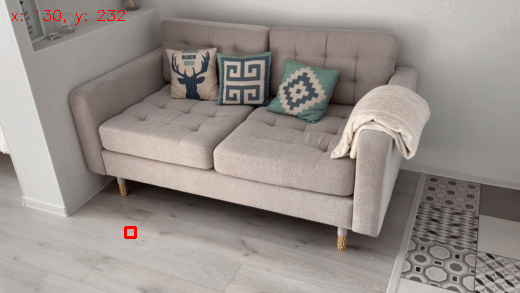

# Pyramidal Implementation of the Lucas Kanade Feature Tracker

This implementation of the KLT tracker is based on the methodology outlined in the paper [here](http://robots.stanford.edu/cs223b04/algo_tracking.pdf).

# Algorithm Performance Results

Below, you can see that the algorithm tracks points well. The coordinates of the tracked point are displayed in the corner. The tracked point is highlighted with the red square.

